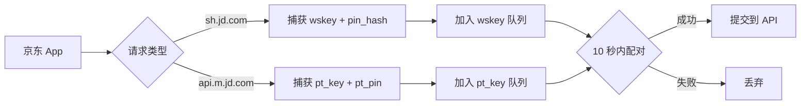

# 📱 iOS 端 - 京东 Cookie 捕获

本文件夹包含 iOS 代理工具（Surge/Quantumult X/Loon）使用的京东 Cookie 捕获脚本。

---

## 📂 文件说明

| 文件 | 用途 | 说明 |
|------|------|------|
| [`JDcookie.js`](./JDcookie.js) | 核心脚本 | 拦截京东 App 请求，获取 wskey 和 pt_key |
| [`JDcookie2api.sgmodule`](./JDcookie2api.sgmodule) | Surge 模块 | 一键订阅，自动配置重写和 MitM |
| [`wskey-update.py`](./wskey-update.py) | 青龙脚本 | 定时转换 wskey 为 pt_key（青龙面板使用） |
| `京东京豆显示美化 + 优化.scriptable` | 快捷指令 | iOS 桌面显示京豆数量（可选） |

---

## 🚀 快速部署

### 方法 1: Surge（推荐）✨

| 步骤 | 操作 |
|------|------|
| **1. 安装模块** | 在 Surge 中打开模块链接 |
| **2. 信任证书** | 设置 → 通用 → 关于本机 → 证书信任设置 |
| **3. 开启 MitM** | 域名：`api.m.jd.com`, `sh.jd.com` |
| **4. 使用** | 打开京东 App，自动捕获 |

**模块链接**:
```
https://raw.githubusercontent.com/1391959853/jd-ios-ck/X/JD/JDcookie2api.sgmodule
```

---

### 方法 2: Quantumult X

**配置文件**:
```ini
[rewrite_local]
^https?://(api\.m\.jd\.com|sh\.jd\.com)/ url script-request-header JDcookie.js

[mitm]
hostname=api.m.jd.com, sh.jd.com
```

**脚本地址**:
```
https://raw.githubusercontent.com/1391959853/jd-ios-ck/X/JD/JDcookie.js
```

---

## 🔧 核心脚本说明

### JDcookie.js

**版本**: 9.7  
**功能**: 拦截京东 App 请求，自动配对 wskey 和 pt_key

#### 工作原理



#### 关键特性

- ✅ **双队列机制** - 分别缓存 wskey 和 pt_key 请求
- ✅ **映射表持久化** - 使用 `JD_PinMap` 存储 `pin_hash ↔ pt_pin` 绑定
- ✅ **智能配对** - 优先使用已验证映射，未验证要求时间差 ≤ 10 秒
- ✅ **去重机制** - 10 秒内同一组合不重复处理
- ✅ **URL 编码** - 提交前自动编码 `pt_pin`

#### 配置说明

编辑 `JDcookie.js` 修改 API 地址：

```javascript
// 第 5 行：修改为你的 API 服务器地址
const API_URL = "http://1.sggg3326.top:9090/jd/raw_ck";
```

#### 本地存储（持久化数据）

| 键名 | 用途 | 说明 |
|------|------|------|
| `JD_PinMap` | pin_hash ↔ pt_pin 映射表 | 已验证的绑定关系 |
| `JD_Wskey_Queue` | wskey 请求队列 | 等待配对的 wskey |
| `JD_PtKey_Queue` | pt_key 请求队列 | 等待配对的 pt_key |
| `JD_Processed_Records` | 已处理记录 | 防止重复提交（10 秒） |

> 💡 **提示**: 可通过 `$prefs.setValueForKey("{}", "键名")` 清空指定存储

---

## 🐉 青龙脚本

### wskey-update.py

**用途**: 在青龙面板定时运行，将 `JD_WSCK` 转换为 `JD_COOKIE`

#### 功能特性

- ✅ 动态从 FRPS 获取 SOCKS5 代理
- ✅ 携趣代理白名单管理
- ✅ 4 小时冷却机制
- ✅ Bark 分组通知（仅失败推送）
- ✅ 自动备注替换为 `京东账号：{pt_pin} - 转换时间:xxxx`

#### 环境变量

| 变量名 | 必填 | 说明 |
|--------|:----:|------|
| `FRPS_API_URL` | ✅ | FRPS 代理接口地址 |
| `FRPS_API_AUTH` | ✅ | FRPS 认证（username:password） |
| `XIEQU_UID` | ✅ | 携趣 UID |
| `XIEQU_UKEY` | ✅ | 携趣 UKey |
| `BARK_SERVER` | ❌ | Bark 服务器地址 |
| `DEBUG_MODE` | ❌ | 调试模式（true/false） |

#### 定时任务

推荐每 **4~6 小时** 运行一次：

```crontab
0 */4 * * *
```

---

## 📱 iOS 端调试

### 查看日志

1. 打开脚本编辑器（如 Scriptable）
2. 运行 `JDcookie.js`
3. 查看控制台输出

### 常见问题

#### 1. 配对失败

**症状**: 日志显示 "配对条件不满足"

**解决**:
- 确认 wskey 和 pt_key 请求时间差 ≤ 10 秒
- 检查 `pin_hash` 是否非空
- 清除旧映射：`$prefs.setValueForKey("{}", "JD_PinMap")`

#### 2. API 提交失败

**症状**: "API 返回失败" 或网络错误

**解决**:
- 检查 API 服务器是否运行
- 确认 `API_URL` 配置正确
- 测试：`curl http://your-api:9090/health`

#### 3. 映射已验证但 pt_pin 错误

**症状**: 配对成功但提交后校验失败

**解决**:
- 删除该账号的映射绑定
- 重新捕获 wskey 和 pt_key

---

## 🔗 相关链接

| 资源 | 地址 |
|------|------|
| Surge 模块 | [JDcookie2api.sgmodule](./JDcookie2api.sgmodule) |
| 核心脚本 | [JDcookie.js](./JDcookie.js) |
| 青龙脚本 | [wskey-update.py](./wskey-update.py) |
| 服务端文档 | [../api/README.md](../api/README.md) |

---

**最后更新**: 2026 年 8 月 14 日
