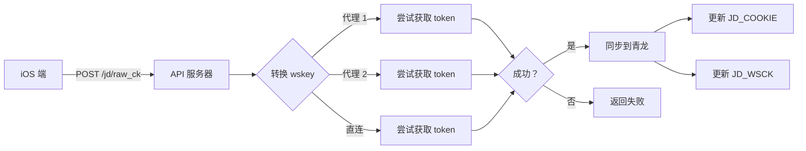

# 🔧 服务端 API - jd-api-server

Flask API 服务器，接收 iOS 端提交的 Cookie 并自动同步到青龙面板。

---

## 📂 文件说明

| 文件 | 用途 | 说明 |
|------|------|------|
| [`app.py`](./app.py) | 主程序 | Flask API 服务器（包含所有业务逻辑） |
| [`Dockerfile`](./Dockerfile) | Docker 镜像 | 容器化部署配置 |
| [`docker-compose.yml`](./docker-compose.yml) | Docker Compose | 一键启动配置 |
| `requirements.txt` | Python 依赖 | `flask`, `requests`, `urllib3`, `PySocks` |

> 💡 **注意**: 配置项直接**硬编码**在 `app.py` 中，修改配置需编辑该文件。

---

## 🚀 快速部署

### 方法 1: Docker（推荐）

```bash
# 启动服务
docker-compose up -d

# 查看日志
docker-compose logs -f

# 停止服务
docker-compose down
```

### 方法 2: 直接运行

```bash
# 安装依赖
pip install -r requirements.txt

# 启动服务
python3 app.py
```

默认监听：`http://0.0.0.0:9090`

---

## 🔧 配置说明

### 核心配置（编辑 `app.py`）

打开 `app.py`，修改以下配置：

```python
# 青龙面板地址（第 30 行左右）
QL_BASE_URL = "http://192.168.188.183:5800"

# 青龙应用凭证（第 31-32 行）
QL_CLIENT_ID = "你的 client_id"
QL_CLIENT_SECRET = "你的 client_secret"

# 服务端口（第 28 行）
SERVER_PORT = 9090
```

### 代理配置（环境变量）

```bash
# 自定义 SOCKS5 代理（可选）
export CUSTOM_SOCKS5_PROXY="socks5://host:port1,socks5://host:port2"

# FRPS 代理源（可选）
export FRPS_API_URL="http://frps-host:7500/api/proxy/tcp"
export FRPS_API_AUTH="username:password"
```

---

## 📡 API 接口

### 健康检查

```bash
GET /health
```

**响应**:
```json
{
  "status": "ok",
  "qinglong_connected": true
}
```

### 接收 Cookie（核心接口）

```bash
POST /jd/raw_ck
Content-Type: application/json
```

**请求体**:
```json
{
  "pt_key": "pt_key_值",
  "pt_pin": "pin_值",
  "wskey": "wskey_值"
}
```

**响应（成功）**:
```json
{
  "code": 200,
  "message": "ok",
  "action": "updated",
  "pt_pin": "你的 pin",
  "match": true,
  "synced_vars": ["JD_COOKIE", "JD_WSCK"],
  "synced": true
}
```

**响应（失败）**:
```json
{
  "code": 400,
  "message": "wskey 不匹配",
  "pt_pin": "你的 pin",
  "match": false,
  "synced": false
}
```

---

## 🔐 工作原理



### 代理策略

1. 从 FRPS API 获取在线 SOCKS5 代理
2. 随机选择 **最多 2 个代理** 尝试
3. 每个代理仅尝试 **1 次**（无重试）
4. 所有代理失败后回退到 **直连**

---

## 🔍 故障排查

### 🔴 问题 1: 青龙连接失败

**症状**: 健康检查返回 `qinglong_connected: false`

**解决方案**:
```bash
# 1. 检查青龙地址
curl http://192.168.188.183:5800/open/envs

# 2. 验证凭证
curl "http://192.168.188.183:5800/open/auth/token?client_id=你的ID&client_secret=你的KEY"

# 3. 测试 API
curl http://ql-host:5700/open/envs -H "Authorization: Bearer 你的 token"
```

---

### 🔴 问题 2: wskey 转换失败

**症状**: 日志显示 "所有代理及直连均无法获取 cookie"

**解决方案**:
```bash
# 1. 检查 FRPS API
curl http://frps-host:7500/api/proxy/tcp

# 2. 测试代理节点
curl -x socks5://proxy:port https://api.m.jd.com

# 3. 查看 API 日志
docker-compose logs | grep "FRPS"
```

---

### 🔴 问题 3: API 无法访问

**症状**: 连接超时或拒绝连接

**解决方案**:
```bash
# 1. 检查端口
netstat -tlnp | grep 9090

# 2. 检查防火墙
ufw status | grep 9090

# 3. 查看日志
docker-compose logs -f
```

---

## 🔗 相关链接

| 资源 | 地址 |
|------|------|
| iOS 端文档 | [../ios/README.md](../ios/README.md) |
| 青龙脚本 | [../ql/README.md](../ql/README.md) |
| 青龙面板 | https://github.com/whyour/qinglong |
| FRPS 文档 | https://gofrp.org |

---

**最后更新**: 2026 年 8 月 14 日
