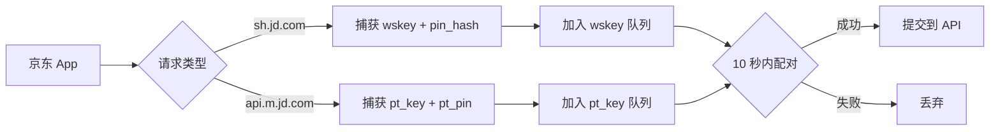

# 📱 iOS 端 - 京东 Cookie 捕获

本文件夹包含 iOS 代理工具（Surge/Quantumult X/Loon）使用的京东 Cookie 捕获脚本。

---

## 📂 文件说明

| 文件 | 用途 | 说明 |
|------|------|------|
| [`JDcookie.js`](./JDcookie.js) | 核心脚本 | 拦截京东 App 请求，获取 wskey 和 pt_key |
| [`JDcookie2api.sgmodule`](./JDcookie2api.sgmodule) | Surge 模块 | 一键订阅，自动配置重写和 MitM |
| `京东京豆显示美化 + 优化.scriptable` | 快捷指令 | iOS 桌面显示京豆数量（可选） |

---

## 🚀 快速部署

### 方法 1: Quantumult X（推荐）⭐

> 💡 **提示**: Quantumult X 用户请使用此方法

#### Step 1. 添加重写规则

打开 Quantumult X → 配置 → 重写 → 添加远程重写：

```
https://raw.githubusercontent.com/1391959853/jd-ios-ck/main/ios/JDcookie2qx.conf
```

或者手动添加本地重写：

```ini
[rewrite_local]
^https?://sh\.jd\.com/ url script-request-header JDcookie.js
^https?://api\.m\.jd\.com/client\.action\?functionId=(wareBusiness|serverConfig|basicConfig) url script-request-header JDcookie.js
```

#### Step 2. 添加脚本

配置 → 脚本库 → 添加远程脚本：

```
https://raw.githubusercontent.com/1391959853/jd-ios-ck/main/ios/JDcookie.js
```

或复制 `JDcookie.js` 内容到本地脚本。

#### Step 3. 配置 MitM

设置 → 通用 → MitM → 启用 MitM → 域名：

```
api.m.jd.com
sh.jd.com
```

#### Step 4. 信任证书

设置 → 通用 → 关于本机 → 证书信任设置 → 信任完全信任证书

#### Step 5. 测试

打开京东 App → 浏览商品 → 查看 Quantumult X 日志是否有输出

---

### 方法 2: Surge

#### Step 1. 安装模块

在 Surge 中打开模块链接：

```
https://raw.githubusercontent.com/1391959853/jd-ios-ck/main/ios/JDcookie2api.sgmodule
```

#### Step 2. 信任证书

设置 → 通用 → 关于本机 → 证书信任设置 → 信任自签名证书

#### Step 3. 开启 MitM

启用 MITM → 域名：`api.m.jd.com`, `sh.jd.com`

#### Step 4. 使用

打开京东 App，自动捕获 Cookie

---

### 方法 3: Loon

#### Step 1. 添加插件

插件 → 添加远程插件：

```
https://raw.githubusercontent.com/1391959853/jd-ios-ck/main/ios/JDcookie2loon.plugin
```

#### Step 2. 配置重写

设置 → 功能设置 → 重写管理 → 添加：

```ini
[Remote]
https://raw.githubusercontent.com/1391959853/jd-ios-ck/main/ios/JDcookie2loon.conf, tag=京东 Cookie 捕获, enabled=true
```

#### Step 3. 信任证书

设置 → 通用 → 证书信任设置 → 信任证书

---

## 🔧 核心脚本说明

### JDcookie.js

**版本**: 9.7  
**功能**: 拦截京东 App 请求，自动配对 wskey 和 pt_key

#### 工作原理



#### 关键特性

- ✅ **双队列机制** - 分别缓存 wskey 和 pt_key 请求
- ✅ **映射表持久化** - 使用 `JD_PinMap` 存储 `pin_hash ↔ pt_pin` 绑定
- ✅ **智能配对** - 优先使用已验证映射，未验证要求时间差 ≤ 10 秒
- ✅ **去重机制** - 10 秒内同一组合不重复处理
- ✅ **URL 编码** - 提交前自动编码 `pt_pin`

#### 配置说明

编辑 `JDcookie.js` 第 5 行，修改 API 地址：

```javascript
// 第 5 行：修改为你的 API 服务器地址
const API_URL = "http://1.sggg3326.top:9090/jd/raw_ck";
```

#### 本地存储（持久化数据）

| 键名 | 用途 | 说明 |
|------|------|------|
| `JD_PinMap` | pin_hash ↔ pt_pin 映射表 | 已验证的绑定关系 |
| `JD_Wskey_Queue` | wskey 请求队列 | 等待配对的 wskey |
| `JD_PtKey_Queue` | pt_key 请求队列 | 等待配对的 pt_key |
| `JD_Processed_Records` | 已处理记录 | 防止重复提交（10 秒） |

> 💡 **提示**: 可通过 `$prefs.setValueForKey("{}", "键名")` 清空指定存储

---

## 📱 Quantumult X 详细配置

### 完整配置文件示例

创建 `JDcookie.conf`：

```ini
[filter_remote]
https://raw.githubusercontent.com/1391959853/jd-ios-ck/main/JDcookie.filter, tag=京东 Cookie 捕获，enabled=true

[rewrite_remote]
https://raw.githubusercontent.com/1391959853/jd-ios-ck/main/ios/JDcookie2qx.conf, tag=京东 Cookie 重写，enabled=true

[script_remote]
https://raw.githubusercontent.com/1391959853/jd-ios-ck/main/ios/JDcookie.js, tag=JDcookie, img-url=jd_logo.png, enabled=true

[mitm]
hostname=api.m.jd.com, sh.jd.com
```

### 日志查看

配置 → 脚本 → 运行日志 → 选择 `JDcookie` 查看输出

---

## 📱 iOS 端调试

### 查看日志

#### Quantumult X

1. 打开 Quantumult X
2. 配置 → 脚本 → 运行日志
3. 选择 `JDcookie` 查看输出

#### Surge

1. 打开 Surge
2. 主界面 → 下方日志图标
3. 筛选 `JDcookie` 关键字

### 常见问题

#### 1. 配对失败

**症状**: 日志显示 "配对条件不满足"

**解决**:
- 确认 wskey 和 pt_key 请求时间差 ≤ 10 秒
- 检查 `pin_hash` 是否非空
- 清除旧映射：`$prefs.setValueForKey("{}", "JD_PinMap")`

#### 2. API 提交失败

**症状**: "API 返回失败" 或网络错误

**解决**:
- 检查 API 服务器是否运行
- 确认 `API_URL` 配置正确
- 测试：`curl http://your-api:9090/health`

#### 3. Quantumult X 无响应

**症状**: 脚本不执行

**解决**:
- 检查 MitM 是否启用
- 确认证书已信任
- 重写规则是否生效（绿色勾选）

---

## 🔗 相关链接

| 资源 | 地址 |
|------|------|
| Surge 模块 | [JDcookie2api.sgmodule](./JDcookie2api.sgmodule) |
| 核心脚本 | [JDcookie.js](./JDcookie.js) |
| 青龙脚本 | [../ql/wskey-update.py](../ql/wskey-update.py) |
| 服务端文档 | [../api/README.md](../api/README.md) |

---

**最后更新**: 2026 年 8 月 14 日
