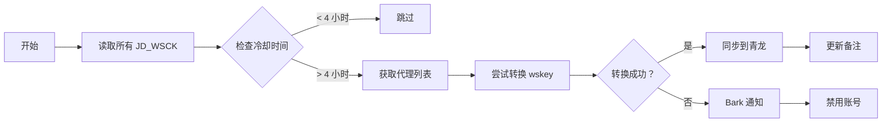

# 🐉 青龙面板脚本

本文件夹包含青龙面板使用的 Python 脚本，用于定时转换 wskey 为 pt_key。

---

## 📂 文件说明

| 文件 | 用途 | 说明 |
|------|------|------|
| [`wskey-update.py`](./wskey-update.py) | 核心脚本 | 定时转换 wskey 为 pt_key |
| [`psyduck-ipv6.py`](./psyduck-ipv6.py) | IPv6 支持 | 可达鸭 IPv6 代理支持脚本 |

---

## 🔧 wskey-update.py

### 功能特性

- ✅ 动态从 FRPS 获取 SOCKS5 代理
- ✅ 携趣代理白名单管理
- ✅ 4 小时冷却机制
- ✅ Bark 分组通知（仅失败推送）
- ✅ 自动备注替换为 `京东账号：{pt_pin} - 转换时间:xxxx`

### 环境变量

| 变量名 | 必填 | 说明 | 示例 |
|--------|:----:|------|------|
| `FRPS_API_URL` | ✅ | FRPS 代理接口地址 | `http://192.168.2.17:7500/api/proxy/tcp` |
| `FRPS_API_AUTH` | ✅ | FRPS 认证（username:password） | `admin:admin` |
| `XIEQU_UID` | ✅ | 携趣 UID | `123456` |
| `XIEQU_UKEY` | ✅ | 携趣 UKey | `xxxxxxxxxx` |
| `BARK_SERVER` | ❌ | Bark 服务器地址 | `https://api.day.app/KEY` |
| `DEBUG_MODE` | ❌ | 调试模式 | `true` / `false` |

### 部署步骤

**Step 1. 添加脚本到青龙**

1. 青龙面板 → 脚本管理 → 新建脚本
2. 名称：`wskey-update.py`
3. 复制 `wskey-update.py` 内容

**Step 2. 配置环境变量**

青龙面板 → 环境变量 → 添加上述环境变量

**Step 3. 设置定时任务**

推荐每 **4~6 小时** 运行一次：

```crontab
0 */4 * * *
```

### 工作流程



---

## 🔧 psyduck-ipv6.py

### 用途

可达鸭（psyduck）项目的 IPv6 代理支持脚本，用于：

- 支持 IPv6 网络环境
- 动态代理切换
- 避免京东风控

### 配置

```python
# 配置 IPv6 代理服务器
IPV6_PROXY = "http://[2408:824c:9c1f:2a31::ea8]:port"
```

---

## 📊 性能建议

| 配置 | 建议值 | 说明 |
|------|--------|------|
| 运行间隔 | 4~6 小时 | 避免触发风控 |
| 代理数量 | 2~5 个 | 过多会增加延迟 |
| 并发请求 | ≤ 10/s | 防止服务器过载 |

---

## 🔍 故障排查

### 🔴 问题 1: 转换失败

**症状**: 日志显示 "所有代理及直连均无法获取 cookie"

**解决方案**:
```bash
# 1. 检查 FRPS API
curl http://frps-host:7500/api/proxy/tcp

# 2. 测试代理节点
curl -x socks5://proxy:port https://api.m.jd.com

# 3. 查看青龙日志
docker logs -f qinglong | grep "FRPS"
```

---

### 🔴 问题 2: Bark 通知不推送

**症状**: 转换失败但无通知

**解决方案**:
```bash
# 1. 测试 Bark 服务
curl "https://api.day.app/KEY/测试"

# 2. 检查 BARK_SERVER 配置
echo $BARK_SERVER

# 3. 确认分组 ID 在脚本中定义
grep -n "BARK_GROUP_MAP" wskey-update.py
```

---

### 🔴 问题 3: 携趣白名单失败

**症状**: 日志显示 "携趣 UID 无效"

**解决方案**:
```bash
# 1. 验证携趣 UID/UKey
curl "https://xiequ.com/api/check?uid=xxx&ukey=xxx"

# 2. 检查环境变量
echo $XIEQU_UID
echo $XIEQU_UKEY

# 3. 联系携趣客服
```

---

## 🔗 相关链接

| 资源 | 地址 |
|------|------|
| iOS 端文档 | [../ios/README.md](../ios/README.md) |
| 服务端 API | [../api/README.md](../api/README.md) |
| 青龙面板 | https://github.com/whyour/qinglong |
| 可达鸭项目 | https://github.com/qitoqito/psyduck |

---

**最后更新**: 2026 年 8 月 14 日
